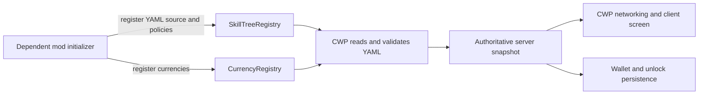

# Crazy World Progression

Crazy World Progression (CWP) is a Fabric framework for server-authoritative currencies, YAML-defined skill trees, persistent random-event scheduling, and temporary template-backed portal dimensions. It provides storage, validation, commands, networking, and a generic client UI while leaving game-specific content to dependent mods.

CWP intentionally ships without currencies, skill trees, earning rules, roles, or world mechanics. [EchelonCore](https://github.com/LeonHosch/EchelonCore) is the reference implementation.

## Requirements

| Component | Version |
| --- | --- |
| Minecraft | 26.2 |
| Java | 25 or newer |
| Fabric Loader | 0.19.3 or newer |
| Fabric API | 0.158.0+26.2 |

CWP must be installed on both the client and server. Purchases and persistence are server-authoritative, but the skill-tree screen and its networking are client-side. Installing CWP alone is valid, although it has no content until another mod registers currencies and tree sources.

## What CWP owns

| CWP framework | Dependent mod |
| --- | --- |
| Currency registration and validation | Currency names, identifiers, icons, colors, aliases, and scope |
| Player and global wallet persistence | How currencies are earned or awarded |
| Generated currency and balance commands | Game-specific commands and reward listeners |
| Direct YAML loading and validation | The YAML files and their gameplay design |
| Personal/global unlock persistence | Roles, factions, elections, or other access rules |
| Prerequisites, branch limits, and purchases | Tree-specific purchase policies |
| Skill-tree networking and screen | Custom content and optional client presentation assets |
| Built-in and extensible stat expressions | Additional stat handlers |
| Generic unique-claim ledger | What an individual claim represents |
| Random-event schedules, blackout windows, and active state | Event definitions, effects, rendering, locations, waves, and rewards |
| Portal template capture, storage, schedules, geometry, instance slots, reconstruction, expiry, and cleanup | The builds captured as templates and any gameplay attached through lifecycle listeners |
| Shared click-driven cuboid selection and private visualization | The workflows that consume a selected area |

The server startup flow is:



## Installation

For a normal Minecraft instance, place these files in the instance's `mods` directory:

1. Fabric API
2. `crazy-world-progression-<version>.jar`
3. At least one content mod that uses CWP, such as EchelonCore

Use the same CWP and content-mod versions on the client and server.

## Using CWP from another mod

No public Maven repository is configured yet. During local development, either include CWP as a sibling Gradle project or depend on a built JAR.

Example sibling layout:

```text
mods-workspace/
├── CrazyWorldProgression/
└── ExampleMod/
```

In the dependent mod's `settings.gradle`:

```groovy
include ':crazy-world-progression'
project(':crazy-world-progression').projectDir = file('../CrazyWorldProgression')
```

In its `build.gradle`:

```groovy
dependencies {
    implementation project(':crazy-world-progression')
}
```

Also declare the runtime dependency in `fabric.mod.json`:

```json
"depends": {
  "crazy-world-progression": ">=1.0.0"
}
```

### Register a currency

Register definitions from the dependent mod's `ModInitializer`. Registration must happen before the server starts because commands and YAML validation use the completed registry.

```java
Identifier renown = Identifier.fromNamespaceAndPath("example", "renown");

CurrencyRegistry.register(new CurrencyDefinition(
        renown,
        "Renown",
        "RN",
        CurrencyDefinition.CurrencyScope.PLAYER,
        Identifier.fromNamespaceAndPath("example", "currencies/renown-32x32.png"),
        0, 0, 32, 32,
        ChatFormatting.AQUA,
        List.of("renown", "rn")
));
```

`PLAYER` creates one wallet per player UUID. `GLOBAL` creates one shared server-wide wallet. Any number of either scope may be registered. Currency IDs and command names must be unique.

The icon identifier points to a texture under the supplying mod's `assets/<namespace>` directory. The four integers select its `u`, `v`, width, and height region.

### Read and change balances

Use `CurrencyService` from server-side reward logic:

```java
long current = CurrencyService.getBalance(server, player.getUUID(), renown);
CurrencyService.credit(server, player.getUUID(), renown, 10);
CurrencyService.debit(server, player.getUUID(), renown, 5);
CurrencyService.setBalance(server, player.getUUID(), renown, 100);
```

All balances are non-negative `long` values. Credits detect overflow, debits clamp at zero, and negative API amounts are rejected. Reward values are chosen by the calling mod and credited exactly as supplied.

Pass `null` as the player UUID for a global-currency operation.

### Register a skill-tree source

Put `.yml` or `.yaml` files in a resource directory owned by the dependent mod. For example, `src/main/resources/skilltrees/adventurer.yml` can be registered with:

```java
SkillTreeRegistry.registerSource("example", "example-mod", "skilltrees");
```

The arguments are the namespace for generated tree and local currency IDs, the Fabric mod ID that owns the resources, and the resource directory. The example file becomes tree ID `example:adventurer`.

CWP reads these resources directly when the server starts. The dependent mod does not translate the YAML first, and remote clients do not read their local YAML copies; they receive a validated snapshot from the server.

### YAML format

```yaml
skilltree: personal
priority: 10
name: Adventurer
gname: Abenteurer
icon: minecraft:compass

skills:
  - id: trailblazer
    name: Trailblazer
    gname: Wegbereiter
    description: Move 5% faster.
    beschreibung: Bewege dich 5 % schneller.
    icon: minecraft:leather_boots
    previous: none
    following: 0
    costs:
      renown: 25
      another-mod:tokens: 2
    stats:
      - addMovementSpeed(5)
```

Tree fields:

| Field | Required | Meaning |
| --- | --- | --- |
| `skilltree` | Yes | `personal` for per-player unlocks or `global` for server-wide unlocks |
| `skills` | Yes | YAML list of skill nodes |
| `priority` | No | Signed integer used to order trees on the same side; lower values appear first and the default is `0` |
| `name` | No | Display name; derived from the filename when omitted |
| `gname` | No | German display name; falls back to `name` |
| `icon` | No | Minecraft item identifier used for the tab icon |

Skill fields:

| Field | Required | Meaning |
| --- | --- | --- |
| `id` | Yes | Unique stable node identifier used by persistence and dependency references |
| `name` | Yes | English display name; it is not used as node identity |
| `gname` | No | German name; falls back to `name` |
| `description` | No | English description |
| `beschreibung` | No | German description; falls back to `description` |
| `icon` | No | Minecraft item identifier; defaults to `minecraft:book` |
| `previous` | No | One predecessor ID, a list of predecessor IDs, or `none` |
| `following` | No | Maximum number of direct successor branches that may be chosen; `0` is unrestricted |
| `costs` | No | Open mapping of currency IDs to non-negative whole-number amounts |
| `stats` | No | List of registered `function(number)` expressions |

Unqualified cost keys such as `renown` use the registered source namespace. Cross-mod costs use a complete identifier such as `another-mod:tokens`. Every referenced currency must already be registered or server startup fails with the YAML filename and error.

Global trees appear on the left and personal trees on the right. Each side starts with its fixed stat-sheet tab, followed by YAML trees ordered by ascending `priority`. Trees with equal priority are ordered alphabetically by YAML filename.

CWP also rejects duplicate YAML keys, missing or duplicate node IDs, unknown predecessor IDs, self-dependencies, cycles, invalid costs, and unknown stat functions. Node names are display-only and may be changed without rewriting `previous`; node IDs are persistence keys and must remain stable after a world has been created.

### Stat expressions

The built-in functions are:

| Expression | Effect |
| --- | --- |
| `addHealth(n)` | Adds `n` max-health points; 2 points equal one heart |
| `addMiningSpeed(n)` | Adds `n` percentage points of block-breaking speed |
| `addMovementSpeed(n)` | Adds `n` percentage points of movement speed |
| `addAttackSpeed(n)` | Adds `n` percentage points of attack speed |
| `addJumpStrength(n)` | Adds `n` percentage points of jump strength |
| `addBlockInteractionRange(n)` | Adds `n` blocks of block interaction range |
| `addEntityInteractionRange(n)` | Adds `n` blocks of entity interaction range |
| `addMobDropMultiplier(n)` | Adds `n` percentage points to loot-table drops from mobs credited to the player |
| `addExperienceMultiplier(n)` | Adds `n` percentage points to positive experience-point awards received by the player |
| `addFarmingMultiplier(n)` | Adds `n` percentage points to drops from blocks in Minecraft's `crops` block tag |

Percentage expressions add percentage points rather than compounding against the configured start. A `+2` bonus always changes 80% to 82%, 100% to 102%, or 200% to 202%. Multiple unlocked expressions sum first, so reward totals of `50` and `25` produce a `1.75x` multiplier from the default `1.0x` baseline. Mob and farming drops use randomized fractional rounding so their long-run average matches the multiplier. Experience rewards round fractional whole-number results down. Final multipliers are clamped to zero output.

Mob, farming, and experience multipliers hook into vanilla server behavior automatically. Farming applies to crop-tagged block loot when a player is present in the loot context; it does not speed up crop growth.

The first left-side menu tab is the global stat sheet. It shows the declared starting value, the global CWP contribution, and their progression total. The first right-side tab additionally separates global and personal contributions. Each sheet only lists functions referenced by a YAML tree of its own scope, so unused built-in stats do not create empty rows. Starting and total values exclude temporary equipment, status effects, and unrelated modifiers; they are stable progression values built from the entity's base attribute plus registered baseline profiles.

### Baseline stat profiles

Content mods can declare permanent starting adjustments with the same expressions used by skill-tree nodes. CWP parses them through `SkillStatRegistry`, then owns player application and stat-sheet calculation:

```yaml
baseline_stats:
  - addHealth(-4)
  - addMiningSpeed(100)
  - addMovementSpeed(40)
```

Register the bundled file during the dependent mod's initializer, before a server starts:

```java
BaselineStatRegistry.registerSource(
        Identifier.fromNamespaceAndPath("example", "default-baseline"),
        "example-mod",
        "baseline-stats.yml"
);
```

Every built-in expression listed in the preceding Stat expressions table is baseline-compatible. Its existing definition supplies the attribute or event target, operation, percentage scaling, display label, and formatting, so baseline profiles and skill trees cannot disagree about what a function means. For example, `addMovementSpeed(-20)` produces the same 20% reduction that it would in a skill node. Percentage expressions below `-100` are rejected in baseline profiles because they would invert a total multiplier.

Attribute baselines are installed under stable profile-specific modifier IDs whenever players join, respawn, or their skill totals refresh. Event-driven baselines are consumed by the same reward paths as their corresponding skill functions. When no profile supplies a function, attributes retain their entity base and reward multipliers start at `1.0x`.

Handlers added through the lightweight `SkillStatRegistry.register(name, handler)` API remain valid for skill trees, but cannot be used in a baseline profile because a handler alone does not expose its operation, scaling, or display metadata.

Register another cumulative handler before trees load:

```java
SkillStatRegistry.register("addArmor", (player, total) -> {
    // Apply the cumulative value from all unlocked nodes.
});
```

Handlers receive the total value accumulated across the player's personal unlocks and the server's global unlocks. They are recalculated after purchases, joins, and respawns.

Application-specific numeric progression can also provide enough metadata to appear on stat sheets and start at a declared value:

```java
SkillStatRegistry.registerNumberStat(
        "addWorldLevel",
        "stat.example.world_level",
        0.0,
        true,
        value -> {
            if (value != 1.0) throw new IllegalArgumentException("addWorldLevel only accepts 1");
        },
        (player, total) -> applyWorldLevel(player.level().getServer(), (int) total)
);
```

The arguments are the function name, translation key, starting value, whether totals are clamped non-negative, per-expression validator, and cumulative application handler. Use `SkillStatRegistry.getGlobalTotal(server, functionName)` when a server-owned mechanic needs the current global-only value without a player profile.

### Add a purchase policy

Trees allow purchases by default. A policy adds game-specific authorization without replacing the framework's cost, prerequisite, or branch checks:

```java
Identifier treeId = Identifier.fromNamespaceAndPath("example", "adventurer");

SkillTreeRegistry.registerPurchasePolicy(treeId, (player, tree) ->
        hasRequiredRole(player)
                ? SkillTreeRegistry.PurchaseDecision.ALLOWED
                : SkillTreeRegistry.PurchaseDecision.denied("You need the required role."));
```

The policy runs both when CWP creates the client snapshot and when the server processes a purchase. Its denial reason appears in the generic screen.

### Record unique claims

`ClaimLedgerService` can prevent duplicate rewards without knowing what the reward represents:

```java
ClaimResult result = ClaimLedgerService.claim(
        server, player.getUUID(), renown, eventId, 10
);
```

The result is `CLAIMED`, `ALREADY_CLAIMED`, or `CLAIM_LIMIT_REACHED`. The ledger only records the claim; the dependent mod decides what to award after a successful result.

### Register random events

CWP schedules and persists event state but deliberately does not implement event gameplay. A dependent mod registers one or more bundled YAML files during initialization:

```java
RandomEventRegistry.registerSource("example", "example-mod", "random-events.yml");
```

One file can define global blackout windows and any number of events:

```yaml
timezone: UTC

blackout_windows:
  - timezone: Europe/Berlin
    weekdays: [FRIDAY]
    start: "19:00"
    end: "00:00"

events:
  - id: blood_moon
    trigger:
      type: in_game_phase
      phase: night
      chance: 0.03
    duration:
      clock: game_time
      ticks: 12000

  - id: rift
    trigger:
      type: real_time
      interval_seconds: 1800
      chance: 0.05
    duration:
      clock: real_time
      seconds: 3600
    availability:
      timezone: UTC
      weekdays: [MONDAY, TUESDAY, WEDNESDAY, THURSDAY, SATURDAY, SUNDAY]
      start: "14:00"
      end: "21:00"
```

These are schema examples, not events shipped by CWP.

Trigger behavior:

| Trigger | Roll behavior |
| --- | --- |
| `in_game_phase` | Rolls once when a new `day` or `night` half-day is first observed; the persisted slot prevents restarts or backward `/time` changes from rerolling it |
| `real_time` | Rolls once per `interval_seconds`; the first interval is scheduled without an immediate startup roll, and missed offline rolls are not replayed |

`chance` is a probability from `0.0` through `1.0`, so `0.03` means 3%. Automatic rolls require at least one connected player. Each event's optional `availability` limits random starts by real weekday and local time. Omitting `availability` permits all times. Times are start-inclusive and end-exclusive; an end before the start creates an overnight window. Equal start and end means the selected whole day. IANA time zones such as `UTC` and `Europe/Berlin` follow daylight-saving changes automatically.

Every matching `blackout_windows` entry suppresses all automatic starts from every registered source. An event that started before a blackout remains active until its own duration ends. `startNow` is an explicit application action and therefore bypasses random-roll, availability, connected-player, and blackout checks.

`game_time` durations are measured in monotonic server ticks and pause while the server is offline. `real_time` durations use epoch time and may expire while the server is offline. Multiple different event IDs may be active simultaneously; the same event ID cannot have overlapping instances.

Register an optional content handler when an event needs gameplay behavior:

```java
Identifier bloodMoon = Identifier.fromNamespaceAndPath("example", "blood_moon");

RandomEventRegistry.registerHandler(bloodMoon, new RandomEventRegistry.RandomEventHandler() {
    @Override
    public void onStarted(MinecraftServer server, RandomEventService.ActiveRandomEvent event) {
        applyBloodMoon(server);
    }

    @Override
    public void onRestored(MinecraftServer server, RandomEventService.ActiveRandomEvent event) {
        applyBloodMoon(server);
    }

    @Override
    public void onEnded(MinecraftServer server, RandomEventService.ActiveRandomEvent event,
                        RandomEventRegistry.EndReason reason) {
        removeBloodMoon(server);
    }
});
```

`RandomEventService.isActive`, `activeEvent`, and `activeEvents` expose authoritative state. `startNow` and `stop` support story logic or future operator commands. Handlers can persist small event-specific values through `putMetadata` and `removeMetadata`; for example, a rift can store its dimension, coordinates, phase, or participant count. Large structures and entity data should remain in the content mod's own storage.

### Create portal templates and temporary dimensions

CWP directly owns portal templates. `/cwp portals workshop enter` opens a dedicated persistent void dimension that is never leased as a live instance; it starts with a single stone block and can hold any number of builds. A game master can build there (or in any other loaded dimension), capture an inclusive cuboid and entry block, and then link any number of placed portals to that stable template ID:

```text
/cwp portals templates capture forgotten_vault -20 60 -20 20 90 20 0 65 0
/cwp portals create vault_gate forgotten_vault ellipse xy 4 6 90
```

The second command creates a 4-by-6 vertical ellipse centered at the command source. Its reconstructed dimension lasts at most 90 real-time minutes from the first entry. Coordinates may use normal relative `~` notation. The capture entry block must lie inside the selected cuboid.

Captured structures and entities are saved as world-generated structure NBT together with CWP metadata. They belong to the world save rather than EchelonCore or another dependent mod, so server administrators can author and update templates entirely in game. A template is limited to 1,048,576 captured blocks to prevent accidental server-ending selections.

Use `/cwp portals workshop leave` to return to the position from which you entered the workshop. Workshop builds persist normally and are never cleared by instance expiry.

The Pockets page in `/cwp admin` provides the command-free authoring workflow. Enter the workshop, press **Select**, then left-click the first block and right-click the opposite block. CWP reserves those clicks so the blocks are not broken, placed, or opened, and draws a private end-rod wireframe around the selected cuboid. Stand at the intended arrival position and press **Set spawn**; the spawn must be inside the selection and is marked with soul-fire particles. **Save draft** requires this explicit spawn and captures the selected area under the template ID in the form. **Clear area** removes the selected workshop draft in bounded server-tick batches after a destructive-action confirmation.

Portal authoring has its own Portals page. Portal IDs, linked templates, geometry, lifetime, placement, removal, and both schedule types are kept separate from pocket-template management. Shape and plane are constrained dropdowns that expose every supported value, preventing invalid free-form input. **Create here** and **Move here** place the portal at the administrator's current position without a command.

Portal shapes are `rectangle`, `ellipse`, `diamond`, and `triangle`. Their two-dimensional plane is one of:

| Plane | Surface axes | Typical use |
| --- | --- | --- |
| `xy` | X and Y, fixed Z | North/south-facing vertical portal |
| `yz` | Z and Y, fixed X | East/west-facing vertical portal |
| `xz` | X and Z, fixed Y | Horizontal floor or ceiling portal |

Open portals display vanilla portal particles across their actual configured shape. Player entry is checked authoritatively against that same finite surface; there are no portal blocks or rectangular collision assumptions.

Calendar and periodic gates are independent and combine with logical AND. For example:

```text
/cwp portals schedule calendar vault_gate "Europe/Berlin" FRIDAY "14:00" "21:00"
/cwp portals schedule periodic vault_gate 360 60
```

This portal is eligible on Fridays from 14:00 until 21:00 Berlin time, but within that range it only opens for 60 minutes in every 360-minute cycle. Quote IANA zones, clock values, and comma-separated weekday lists because they contain command punctuation, for example `"MONDAY,WEDNESDAY,FRIDAY"`. The first periodic window begins when the periodic command is executed. Overnight calendar windows are supported; equal start and end means the selected complete weekday. Use `clear-calendar` or `clear-periodic` to remove either restriction without changing the other.

Minecraft cannot safely add and remove registry-backed dimensions while a server is already running. CWP therefore ships eight registered empty void dimensions and leases them as reusable instance slots. On first entry, it reconstructs the linked template in a free slot and remembers each player's source position. When the real-time lifetime expires—even if it elapsed while the server was offline—CWP closes entry, evacuates every player, removes non-player entities, clears the reconstructed blocks in batches of 8,192 per tick, and releases the slot for a fresh reconstruction. Up to eight portal instances can therefore be active concurrently; the number of stored templates and placed portals is not limited by the slot count.

Players may intentionally leave an active instance with `/portal leave`. This returns them to their remembered entry position and clears any respawn point aimed at an instance slot. A player who disconnects inside a slot is returned when reconnecting, preventing an offline profile from becoming stranded in a cleared or subsequently reused instance. After a restart, when the runtime return position is unavailable, evacuation safely falls back to the overworld spawn.

Content mods can register more predeclared empty slots with `PortalRegistry.registerInstanceSlot` and react to reconstruction or expiry with `PortalRegistry.registerListener`. `PortalService.ActiveInstance` exposes the portal ID, template ID, leased dimension, origin, size, creation time, and expiry time without making template copying content-specific.

### Reuse area selection

Other mods can start CWP's selector for any server player and tag the session with their own owner ID:

```java
Identifier owner = Identifier.fromNamespaceAndPath("example", "region_editor");
AreaSelectionService.begin(player, owner);

AreaSelectionService.Selection selection = AreaSelectionService.requireComplete(player);
BlockPos minimum = selection.minimum();
BlockPos maximum = selection.maximum();
long volume = selection.volume();

AreaSelectionService.setAnchor(player, player.blockPosition());
BlockPos anchor = AreaSelectionService.requireComplete(player).anchor();

AreaSelectionService.clear(player);
```

`selection(player)` returns an optional incomplete or complete snapshot, and `isSelecting(player)` reports whether the clicks are currently reserved. A consumer may use `setAnchor` to attach one in-bounds block, such as a spawn or origin, to the selected cuboid. `AreaSelectionRegistry.registerListener` can observe starts, corner/anchor changes, and cancellation; listeners should check `selection.owner()` before consuming another feature's session. Selections are server-authoritative, limited to the player's current dimension, cleared on disconnect, and visualized only to their owner. CWP validates selector click distance and loaded chunks even though the click packet originates on the client.

## Commands

CWP generates commands from every registered currency. In these examples, `renown` is player-scoped and `influence` is global.

| Command | Permission | Description |
| --- | --- | --- |
| `/balance` | Player | Show every registered balance |
| `/balance <targets>` | Game master | Show every balance for selected profiles |
| `/renown` | Player | Show the executing player's Renown |
| `/renown <targets>` | Game master | Show selected profiles' Renown |
| `/renown give <amount> <targets>` | Game master | Credit player wallets |
| `/renown take <amount> <targets>` | Game master | Debit player wallets, clamped at zero |
| `/renown set <amount> <targets>` | Game master | Set player wallets |
| `/influence` | Player | Show the shared global balance |
| `/influence give\|take\|set <amount>` | Game master | Change the shared global wallet |
| `/skill` | Player | Open the skill-tree screen |
| `/cwp admin` | Game master | Open the modular CWP administration dashboard |
| `/cwp` or `/cwp status` | Game master | Show loaded currencies, trees, stat functions, events, handlers, active events, and blackout state |
| `/cwp help` | Game master | Show the available CWP administration branches |
| `/cwp events` | Game master | Summarize the random-event scheduler |
| `/cwp events list [page]` | Game master | List loaded event IDs, triggers, chances, handlers, and active markers |
| `/cwp events active [page]` | Game master | List active instances, remaining duration, and metadata-key counts |
| `/cwp events blackouts [page]` | Game master | List blackout schedules and mark windows that are active now |
| `/cwp events info <event>` | Game master | Inspect one event's trigger, duration, availability, handler, state, and metadata |
| `/cwp events start <event>` | Game master | Force-start a configured event through its normal lifecycle handler |
| `/cwp events stop <event>` | Game master | Stop an active event and invoke its cleanup handler |
| `/cwp currencies list [page]` | Game master | List all registered currencies and scopes |
| `/cwp currencies info <currency>` | Game master | Inspect currency names, aliases, scope, and icon metadata |
| `/cwp skilltrees list [page]` | Game master | List loaded trees, priorities, types, node counts, and policy markers |
| `/cwp skilltrees info <tree>` | Game master | Inspect one tree's structure, currencies, expressions, and purchase policy |
| `/cwp stats` | Game master | List stat functions and loaded baseline-profile coverage |
| `/cwp stats refresh` | Game master | Reapply current baseline and progression stats to online players |
| `/cwp portals` | Game master | Show template, portal, active-instance, and slot totals |
| `/cwp portals list` | Game master | List placed portals, linked templates, shapes, planes, and current open state |
| `/cwp portals info <portal>` | Game master | Inspect one portal's geometry, lifetime, and combined schedule |
| `/cwp portals templates capture <template> <from> <to> <spawn>` | Game master | Capture a cuboid and its relative entry block into CWP template storage |
| `/cwp portals templates list` | Game master | List captured template sizes and entry offsets |
| `/cwp portals workshop enter\|leave` | Game master | Enter or leave the persistent void template-authoring dimension |
| `/cwp portals create <portal> <template> <shape> <plane> <width> <height> <lifetime_minutes>` | Game master | Place and directly link a portal at the command source |
| `/cwp portals move <portal> here` | Game master | Move a placed portal to the command source and dimension |
| `/cwp portals link <portal> <template>` | Game master | Change the template used by future instances |
| `/cwp portals lifetime <portal> <minutes>` | Game master | Change the lifetime used by future instances |
| `/cwp portals schedule calendar <portal> <timezone> <weekdays> <start> <end>` | Game master | Set a recurring local-time entry gate |
| `/cwp portals schedule periodic <portal> <every_minutes> <open_minutes>` | Game master | Set and anchor a repeating timer window |
| `/cwp portals schedule clear-calendar\|clear-periodic <portal>` | Game master | Remove one schedule gate |
| `/cwp portals instances list` | Game master | List leased slots and real-time expiry timestamps |
| `/cwp portals instances expire <portal>` | Game master | Evacuate and reset an instance immediately |
| `/cwp portals remove <portal>` | Game master | Expire any instance and remove the placed portal |
| `/portal leave` | Player | Leave a temporary CWP instance through its remembered return point |
| `/cwp sources` | Game master | Show dependent mods and resources registered with each CWP loader |
| `/cwp reload` | Game master | Reload all YAML, reconcile removed active events, and refresh online-player stats |

Every additional command name in a currency definition is registered as an alias of its primary command.

All identifier arguments use complete namespaced IDs such as `echelon-core:blood_moon`. Loaded identifiers are offered as command suggestions. Potentially long definition lists use eight entries per page.

## Modular admin panel

`/cwp admin` opens a server-authoritative dashboard. CWP contributes native pages for framework health, pocket dimensions, currencies, skill trees, and random events. It supports live refresh, scrollable status cards, reusable text fields, server-provided autocomplete suggestions, action feedback, and second-click confirmation for destructive controls. The server rechecks game-master permission for every page and action packet; hiding a button on the client is never treated as authorization.

The Currency page lists registered currencies rather than every online-player wallet. Its shared form accepts an online player name with Tab completion and a non-negative amount; each currency row then provides **Give**, **Take**, and **Set**. Global currencies ignore the player field. Pockets includes workshop entry, click selection, explicit spawn selection, draft capture/clearing, templates, and live instances. Portals is a separate page for placement, constrained shape/plane selection, editing, scheduling, and placed-portal status.

Dependent mods add a top-level button by registering an `AdminPanelRegistry.AdminModule` during common initialization. A module supplies identifying text, a default page, a page provider, and an action handler. Pages use CWP's neutral `AdminPage`, `AdminTab`, `AdminEntry`, `AdminField`, and `AdminAction` records, so extensions do not need their own screen classes, payloads, rendering code, or a CWP-side dependency on the content mod. Each action receives the submitted field-value map. Providers are evaluated on the server whenever an administrator navigates or refreshes, and action IDs are opaque values interpreted only by their owning module.

## Persistence and authority

- Wallets, unlocks, claim ledgers, active events, event metadata, scheduler roll cursors, portal definitions, template metadata, and instance leases live in the world's persistent server state.
- Global unlocks and balances are shared by the entire server; personal values are keyed by player UUID.
- The server validates and applies purchases atomically on its server thread.
- The client receives dynamic tree, unlock, policy, and currency snapshots and cannot directly edit authoritative state.
- Legacy EP, FC, PS, KP, claim, unlock, and elected-king fields are migrated when old saves are read. The elected king is retained as migration data for EchelonCore to adopt.

Back up a world before testing migrations or changing stable currency/tree/node IDs.

## Development

Clone the repository and run commands from its root:

```powershell
# Compile and package the mod
.\gradlew.bat build

# Launch a development client as Admin
.\gradlew.bat runClient

# Launch the second configured client as Player
.\gradlew.bat runClient2

# Launch a development server
.\gradlew.bat runServer
```

Build output is written to `build/libs/crazy-world-progression-1.0.0.jar`. The dedicated-server run requires accepting the EULA in `run/eula.txt` after its first launch.

The repository includes the Gradle wrapper, so a separate Gradle installation is not required. A Java 25 JDK must be available.

## Current limitations

- CWP is not useful gameplay content by itself; another mod must register content.
- Currency earning logic is deliberately outside the framework.
- Admin modules are intentionally data-driven; extensions that require specialized editors should keep those screens separate and link their server operations to the same services.

## License

Crazy World Progression is licensed under [AGPL-3.0-only](LICENSE).
